# Stock Data Modeling

This repository contains a complete analytical data model for building a reliable and query-friendly stock market dataset.  
The goal is to demonstrate data modeling skills using clear dimensional design, clean DDL, and well-defined tests.

The project models three core domains:
- **Company fundamentals**
- **Daily stock prices (OHLCV)**
- **Financial statements**

The repo focuses on:
- Entity Relationship Diagrams (ERDs)
- Dimensional modeling
- DDL for table creation
- Data quality tests

This project does *not* include ingestion pipelines, orchestration, or machine learning.  

---
## Entire ERD

```mermaid
---
config:
  layout: dagre
---
erDiagram
	STOCK_SYMBOLS {
		char(64) symbol_id  "🔑"  
		varchar(10) symbol  ""  
		varchar(10) exchange  ""  
		varchar(10) type  ""  
		varchar(255) organ_short_name  ""  
		varchar(255) organ_name  ""  
		varchar(10) product_grp_id  ""  
		timestamptz valid_from  ""  
		timestamptz valid_to  ""  
	}
	COMPANY_PROFILES {
		char(64) symbol_id  "🔗"  
		varchar(10) symbol  ""  
		bigint issue_share  ""  
		text history  ""  
		text company_profile  ""  
		varchar(255) icb_name3  ""  
		varchar(255) icb_name2  ""  
		varchar(255) icb_name4  ""  
		numeric(20_4) financial_ratio_issue_share  ""  
		numeric(20_4) charter_capital  "" 
		timestamptz valid_from  ""  
		timestamptz valid_to  ""   
	}
	INGESTION_SOURCES {
		int source_id  "🔑"  
		varchar(100) source_name  ""  
		varchar(255) source_url  ""  
		bool is_active  ""  
		text api_endpoint  ""  
		varchar(100) frequency  ""  
		timestamptz last_checked_at  ""  
		timestamptz created_at  ""
	}
	QUOTE_INTRADAY {
		timestamptz time  "🗄️"  
		char(64) symbol_id  "🔗"  
		varchar(10) symbol  ""  
		numeric(10_1) price  ""  
		int volume  ""  
		varchar(10) match_type  ""  
		int source_id  "🔗"  
	}
	QUOTE_HISTORICAL {
		timestamptz time  "🗄️"  
		char(64) symbol_id  "🔗"  
		varchar(10) symbol  ""  
		numeric(15_2) open  ""  
		numeric(15_2) high  ""  
		numeric(15_2) low  ""  
		numeric(15_2) close  ""  
		int volume  ""  
	}
	FINANCIAL_DICT {
		varchar(64) metric_id  "🔑" 
		varchar(255) metric_code  ""  
		varchar(255) name  ""  
		varchar(255) en_name  ""  
		varchar(255) type  ""  
		int order  ""  
		varchar(100) unit  ""  
		varchar(10) com_type_code  ""  
	}
	REPORT_PERIOD {
		int report_id  "🔑"  
		char(64) symbol_id  "🔗"  
		varchar(10) symbol  ""  
		int year_report  ""  
		smallint length_report  ""  
		timestamptz created_at  ""  
		 
	}
	BALANCE_SHEET {
		int report_id  "🔗"  
		varchar(64) metric_id  "🔗" 
		varchar(100) metric_code  ""  
		int year_report  "🗄️"  
		smallint length_report  "🗄️"  
		numeric(20_4) metric_value  ""  

	}
	INCOME_STATEMENT {
		int report_id  "🔗"  
		varchar(64) metric_id  "🔗" 
		varchar(100) metric_code  ""  
		int year_report  "🗄️"  
		smallint length_report  "🗄️"  
		numeric(20_4) metric_value  "" 
		
	}
	CASHFLOW {
		int report_id  "🔗"  
		varchar(64) metric_id  "🔗" 
		varchar(100) metric_code  ""  
		int year_report  "🗄️"  
		smallint length_report  "🗄️"  
		numeric(20_4) metric_value  ""  
		
	}
	MARKET_RATIOS {
		int report_id  "🔗"  
		varchar(64) metric_id  "🔗" 
		varchar(100) metric_code  ""  
		int year_report  "🗄️"  
		smallint length_report  "🗄️"  
		numeric(20_4) metric_value  ""  
		
	}

	STOCK_SYMBOLS||--o{COMPANY_PROFILES:"has"
	STOCK_SYMBOLS||--o{QUOTE_INTRADAY:"performs"
	INGESTION_SOURCES||--o{QUOTE_INTRADAY:"specifies"
	STOCK_SYMBOLS||--o{QUOTE_HISTORICAL:"contains"
	STOCK_SYMBOLS||--o{REPORT_PERIOD:"contains"
	FINANCIAL_DICT||--o{BALANCE_SHEET:"mapping"
	FINANCIAL_DICT||--o{INCOME_STATEMENT:"mapping"
	FINANCIAL_DICT||--o{CASHFLOW:"mapping"
	FINANCIAL_DICT||--o{MARKET_RATIOS:"mapping"

	REPORT_PERIOD||--o{BALANCE_SHEET:"contains"
	REPORT_PERIOD||--o{INCOME_STATEMENT:"contains"
	REPORT_PERIOD||--o{CASHFLOW:"contains"
	REPORT_PERIOD||--o{MARKET_RATIOS:"contains"
```

---
## Project Structure

---
## Objectives

- Design a clean analytical schema for stock data
- Define clear entities and relationships
- Provide reproducible DDL for database creation
- Apply modeling best practices: surrogate keys, star schema, partitioning, indexing
- Demonstrate test coverage and quality checks
- Enable analysts, quants, or ML teams to query reliable data

---
## Design Principles

- Use normalized modeling **(3NF)** for reference and financial data.
- Apply temporal modeling using valid_from / valid_to for symbol metadata.
- **Partition** large fact tables (intraday, historical, financials) by time for performance.
- Ensure **surrogate keys** are generated deterministically via pgcrypto.
- Enforce model integrity using **foreign key** constraints and uniqueness rules.

---
## Use Cases Supported

- Time-series forecasting (LSTM, Prophet, ARIMA)
- Market analytics (OHLCV, volatility, liquidity analysis)
- Financial ratio calculations from multi-statement data
- Corporate actions & sector classification analysis

---
## Limitations & Future Extensions

The current data model focuses primarily on basic OHLCV (Open, High, Low, Close, Volume) stock data. The following features and improvements should be considered for future development:

### Future Extensions

**1. Support for Corporate Actions (Dividends, Splits)**

> This is a **mandatory requirement** to accurately calculate **Total Return** and correctly adjust historical stock prices. We will need to implement dedicated event tables (Fact Tables) to record and apply changes related to dividends and stock split/reverse split ratios.

**2. Add Dimension Tables for Sector / Industry Hierarchies**

> Classifying companies by their Sector and Industry is crucial for effective group analysis. This descriptive data should be normalized into separate **Dimension Tables** to improve the efficiency of filtering, grouping, and analytical queries on the main fact tables.

**3. Add Materialized Views for Daily Aggregates**

> To accelerate queries for frequently calculated technical indicators and aggregate metrics (e.g., Moving Averages, RSI), we should define and materialize these views. This offloads computational burden by pre-calculating and physically storing the results.

**4. Consider ClickHouse for Intraday Data at Scale**

> Intraday data (minute-by-minute or tick data) is extremely high-volume and inherently time-series in nature. We should consider using columnar database management systems like **ClickHouse** to ensure high-performance storage and analytical query speed for large-scale granular data.
