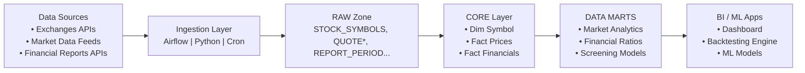

# Data Flow Architecture

This document outlines the data flow across the system, including ingestion, storage, transformations, and consumption.

---
## 1. Raw Data Ingestion

Data from multiple external sources is collected through:
- REST APIs
- Batch CSV/JSON pulls
- Scheduled ingestion jobs

Data is stored in **raw tables**:
- `STOCK_SYMBOLS`
- `COMPANY_PROFILES`
- `INGESTION_SOURCES`
- Raw price and financial datasets

Raw data is kept unchanged to preserve traceability.

---
## 2. Processing Layers

The system follows a multi-layer architecture:

**Raw Layer**

Direct dump from upstream sources.
No transformations except schema enforcement.

**Staging Layer**

Light cleaning and type standardization:
- Normalize column names
- Parse timestamps
- Standardize numeric formats
- De-duplicate data

**Core Layer**

Modeled around business entities:
- Stock symbols
- Price facts
- Financial period facts
- Industry and metric dimensions

Ensures referential integrity and consistent surrogate keys.

**Mart Layer**

Analytics-ready tables:
- Daily aggregated metrics
- Time-series features
- Financial ratios
- Inputs for ML pipelines

## 3. Downstream Consumption

Data supports different use cases:

**Analytics**
- Performance dashboards
- Sector comparisons
- Liquidity and volatility analyses

**Machine Learning**
- Predictive models using OHLCV data
- Financial metric-based forecasting
- Intraday anomaly detection

**Data Products**
- APIs
- BI tools
- Data exports

## 4. High-Level Flow Diagram
> External APIs → Raw Layer → Staging → Core Models → Marts → Dashboards / ML Models

The architecture ensures:

- Full lineage
- Separation of concerns
- Scalability for real-time and batch workloads